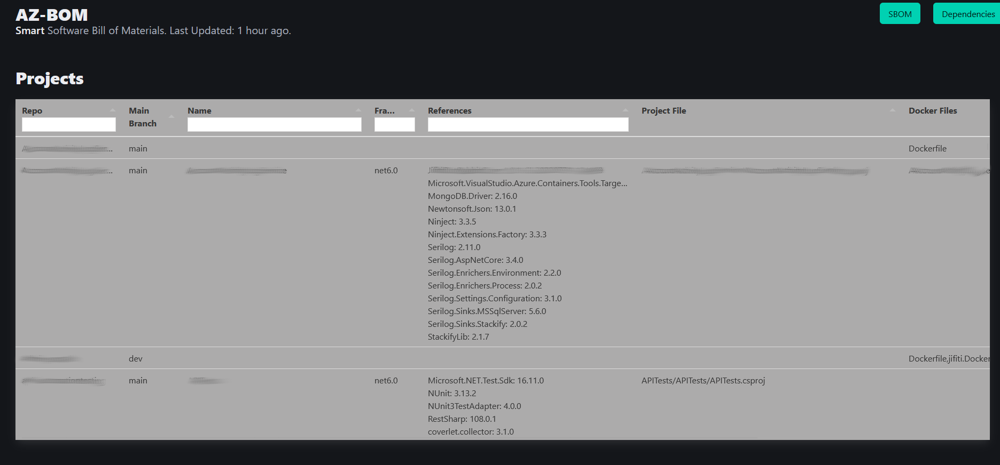
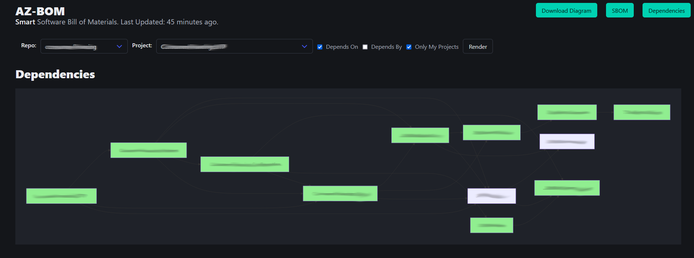

# AzBOM

Smart Azure Software BOM

## Overview

AzBOM is a tool that helps you to manage your Azure DevOps projects and repositories. It provides a simple way to list all the repositories in your organization and their dependencies.

AzBOM uses the Azure PAT (Personal Access Token) to access the Azure DevOps API. It fetches the list of repositories and their dependencies, performing analysis for each CSProj file it finds. 

The datafile is being build in the background and updated automatically every 24 hours.

On first run, the web server will start only after first datafile is created.

### SBOM View



Shows the list of repositories in your organization and their dependencies.

* Internal (Project) dependencies are shown in *italic*
* Details Main files for executable projects
* Details Dockerfiles for containerized projects

### Dependency View



Shows the list of dependencies for a specific project. Click "Render" to see the dependency graph.

Options:

* **Depends On** - Shows the list of dependencies for the selected project
* **Depended By** - Shows the list of projects that depend on the selected project
* **Only My Projects** - Shows only the projects that are in the same organization as the selected project

Legend:

* Different colors represent different framework versions (net6.0, net8.0, etc)
* Rectangle border represents a library (DLL)
* Round border represents an executable (EXE)


### Build and Run

```bash
go build 
docker build -t azbom:latest .
```

For running you need to [create a Personal Access Token (PAT)](https://learn.microsoft.com/en-us/azure/devops/organizations/accounts/use-personal-access-tokens-to-authenticate?view=azure-devops&tabs=Windows#create-a-pat) in Azure DevOps and provide it as an environment variable. 

```
docker run -p 8080:8080 -e ORGANIZATION_URL="https://dev.azure.com/{Your-Organization-ID}" -e PAT="{Personal-Access-Token}" --name azbom azbom:latest
```